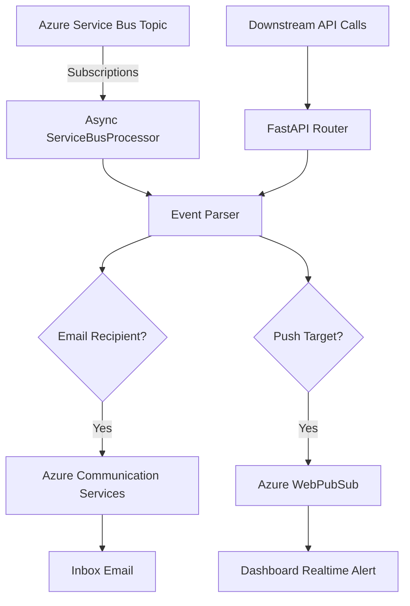

# 🔔 OrganiStation Notification Service

The **Notification Service** is an event-driven Python FastAPI microservice responsible for real-time push alerting and email delivery across the OrganiStation ecosystem. It operates both as an HTTP REST API and as an asynchronous listener consuming events from **Azure Service Bus**.

---

## ✨ Key Features

- **Asynchronous Event Consumer**: Listens to the Azure Service Bus topic `notifications` on startup, processing messages from three main subscriptions:
  - `leave-notifications` (Leave applications and statuses)
  - `manager-notifications` (Manager action alerts)
  - `hr-announcements` (Broadcasting company notices)
- **Transactional Email Dispatch**: Integrates with **Azure Communication Services (ACS)** to send transactional emails securely without traditional SMTP server overhead.
- **Real-Time Push Alerts**: Integrates with **Azure WebPubSub Service** (acting as the WebSocket host) to deliver instant updates to users currently active on the frontend dashboard.
- **Direct REST API Access**: Downstream services can trigger direct emails, broadcasts (restricted to HR managers), or target specific user alerts via HTTP POST endpoints.
- **JWT Authorization**: Protects REST API endpoints by validating user tokens and role claims against the platform’s `JWT_SECRET`.

---

## 🛠️ Technology Stack

- **Framework**: FastAPI (Python 3.10+)
- **Messaging Broker**: Azure Service Bus (`azure-servicebus` async library)
- **Email Gateway**: Azure Communication Services (`azure-communication-email`)
- **Real-time Push Gateway**: Azure WebPubSub Service (`azure-messaging-webpubsubservice`)

---

## 📂 Architecture & Event Flow



---

## ⚙️ Configuration & Environment Variables

Create a `.env` file in the root of the `notification-service` directory (you can copy `.env.example` as a template).

| Variable | Description | Default | Required |
| :--- | :--- | :--- | :--- |
| `PORT` | Service port | `8007` | No |
| `HOST` | Bind address | `0.0.0.0` | No |
| `SERVICE_BUS_NAMESPACE` | Connection string or fully qualified namespace for Azure Service Bus | *None* | Optional (disables listener if empty) |
| `ACS_CONNECTION_STRING` | Connection string for Azure Communication Services | *None* | Optional (disables email if empty) |
| `SENDER_EMAIL` | Verified sender email address in Azure | `donotreply@organistation.com` | Yes (if using email) |
| `SIGNALR_CONNECTION_STRING` | Connection string for Azure WebPubSub hub | *None* | Optional (disables push if empty) |
| `JWT_SECRET` | Secret key used for validating authorization tokens | `change-me-in-prod` | Yes (for REST routes) |

---

## 🚀 API Endpoints

### 📣 Notification API Routes (`/notifications`)

* **`POST /notifications/send-email`**:
  - Direct endpoint for internal microservices to request email delivery.
  - **Payload**:
    ```json
    {
      "email": "recipient@organistation.com",
      "title": "Email Subject",
      "message": "Plain text body contents..."
    }
    ```

* **`POST /notifications/broadcast`**:
  - Broadcasts a realtime notification to a department group or all active connections. Restricted to users with the **HR** role.
  - **Payload**:
    ```json
    {
      "title": "HR Notice",
      "message": "The office will be closed on Friday.",
      "department": "Engineering"
    }
    ```

* **`POST /notifications/user/{userId}`**:
  - Sends a direct realtime push alert to a specific employee ID.

---

## 💻 Local Development

### 1. Setup Virtual Environment
```bash
python -m venv venv
source venv/bin/activate  # On Windows: .\venv\Scripts\activate
pip install -r requirements.txt
```

### 2. Run the Server
```bash
python -m uvicorn src.main:app --host 0.0.0.0 --port 8007 --reload
```
The server will start at `http://localhost:8007`. You can access interactive API docs at `http://localhost:8007/docs`.

---

## 🐳 Docker Deployment

To build and run the service inside a Docker container:

```bash
# Build the Image
docker build -t organistation-notification-service .

# Run the Container
docker run -d \
  -p 8007:8007 \
  --env-file .env \
  organistation-notification-service
```
